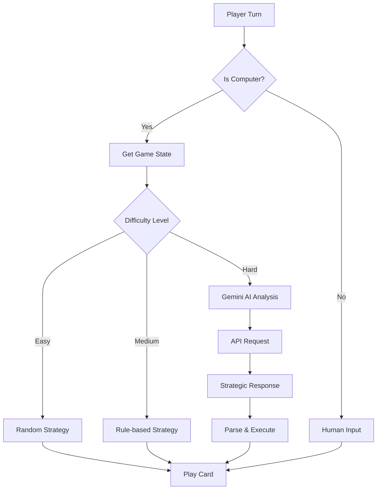

# UNO CLI Game

<div align="center">


**A feature-rich, terminal-based UNO card game with AI opponents powered by Google Gemini**

</div>

---

## 🌟 Features

### 🎮 Core Game Features
- **Complete UNO Implementation** - All official UNO rules and card types
- **Beautiful CLI Interface** - Colorful, intuitive terminal-based UI
- **Cross-Platform** - Works on Windows, macOS, and Linux
- **Real-time Game State** - Live updates of hands, deck, and game status

### 🤖 AI Opponents
- **Rookie AI** - Perfect for beginners with random strategic moves
- **Smart AI** - Balanced difficulty with tactical decision-making
- **Genius AI** - Advanced AI powered by Google Gemini 2.0 Flash

### ⚡ Advanced Features
- **Dynamic Difficulty Scaling** - Choose your challenge level
- **Strategic AI Analysis** - AI explains its moves and reasoning
- **Game State Logging** - Track recent actions and moves
- **Intelligent Card Suggestions** - AI considers opponent hand size and game state
- **Auto-deck Reshuffling** - Seamless gameplay with automatic deck management

---

## 🚀 Installation

### Prerequisites
- Python 3.7 or higher
- Internet connection (for Genius AI mode)
- Terminal with color support

### Quick Setup

1. **Clone the repository**
   ```bash
   git clone https://github.com/volksgeistt/uno
   cd uno
   ```

2. **Install dependencies**
   ```bash
   pip install requests
   ```

3. **Run the game**
   ```bash
   python uno.py
   ```

### 🔑 Optional: Gemini API Setup (for Genius AI)

To unlock the most challenging AI opponent:

1. Get a free Gemini API key from [Google AI Studio](https://aistudio.google.com/app/apikey)
2. Run the game - you'll be prompted to enter your API key
3. Enjoy playing against advanced AI!

---

## 🎯 Usage

### Starting a Game

```bash
python uno.py
```

### Game Controls

| Action | Input | Description |
|--------|-------|-------------|
| Play Card | `1-9` | Select card from playable options |
| Draw Card | `d` | Draw from deck |
| Wild Color | `R/B/G/Y` | Choose color for Wild cards |
| Exit Game | `Ctrl+C` | Safely exit the game |

### Example Gameplay

```
🎯 UNO GAME
--------------------------------------------------
Current Card: Red 7 | Color: Red
Deck: 45 cards

▶ Player1: 6 cards
  Computer (Medium): 5 cards

Recent Actions:
  • Game started! Difficulty: Medium
  • Computer played Blue Skip
  • Player1's turn skipped

Your Hand:
  1. Red 9
  2. Blue 2
  3. Green Skip
  4. Wild Draw Four

Playable Cards:
  1. Red 9
  2. Wild Draw Four

Play card (1-2) or 'd' to draw: 
```

---

## 🤖 AI Opponents

### 🟢 Rookie AI
- **Difficulty**: Easy
- **Strategy**: Random moves with occasional mistakes
- **Best For**: Learning the game, casual play
- **Features**: 
  - Random card selection
  - Basic rule following
  - 30% chance of suboptimal plays

### 🟡 Smart AI
- **Difficulty**: Medium  
- **Strategy**: Tactical gameplay with strategic thinking
- **Best For**: Regular players wanting a challenge
- **Features**:
  - Prioritizes action cards
  - Prevents opponent victories
  - Considers hand size strategy
  - Color management

### 🔴 Genius AI
- **Difficulty**: Hard
- **Strategy**: Advanced AI powered by Google Gemini
- **Best For**: Expert players and AI enthusiasts
- **Features**:
  - Real-time strategic analysis
  - Contextual decision making
  - Explains reasoning for moves
  - Adapts to game state
  - Considers opponent psychology

---

## 🎨 Game Interface

### Welcome Screen
```
    ██    ██ ███    ██  ██████          
    ██    ██ ████   ██ ██    ██        
    ██    ██ ██ ██  ██ ██    ██        
    ██    ██ ██  ██ ██ ██    ██        
     ██████  ██   ████  ██████         
                                                
Cli-Based Card Game Interface                                            

Challenge yourself against smart AI opponents
Experience the classic card game with modern AI!
```

### AI Selection Menu
```
🤖 CHOOSE YOUR OPPONENT
────────────────────────────────────────

┌─ 1. ROOKIE AI ─────────────────────────┐
│  • Perfect for beginners                 │
│  • Random strategic moves                │
│  • Easy to beat                          │
└────────────────────────────────────────┘

┌─ 2. SMART AI ──────────────────────────┐
│  • Balanced difficulty                   │
│  • Uses basic game strategy              │  
│  • Good for practice                     │
└────────────────────────────────────────┘

┌─ 3. GENIUS AI ─────────────────────────┐
│  • Ultimate challenge                    │
│  • Powered by Google Gemini AI          │
│  • Advanced strategic thinking           │
│  ✓ UNLOCKED - Ready to play!           │
└────────────────────────────────────────┘
```

---

### AI Integration Flow


---

## 🎮 Game Rules

### Standard UNO Rules Implemented

- **Number Cards (0-9)**: Match color or number
- **Action Cards**:
  - **Skip**: Next player loses turn
  - **Reverse**: Change direction of play
  - **Draw Two**: Next player draws 2 cards
- **Wild Cards**:
  - **Wild**: Change color
  - **Wild Draw Four**: Change color, next player draws 4

### Special Features

- **UNO Declaration**: Automatic when player has 1 card
- **Deck Reshuffling**: Automatic when deck runs out
- **Strategic AI**: Considers game state for optimal plays


<div align="center">


</div>
